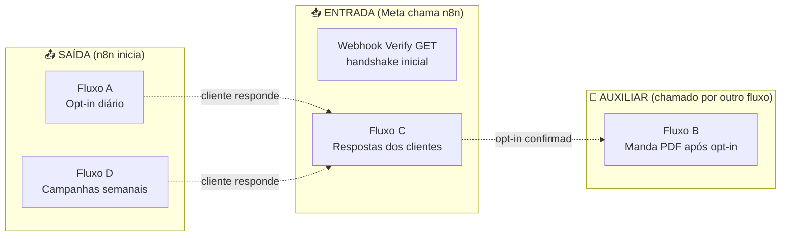
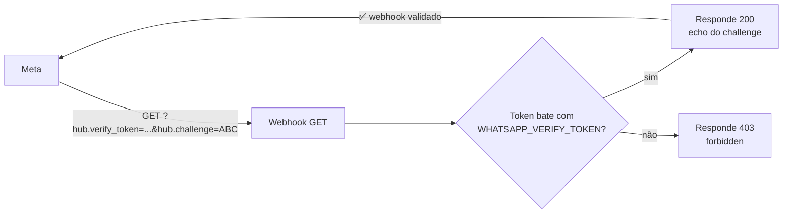
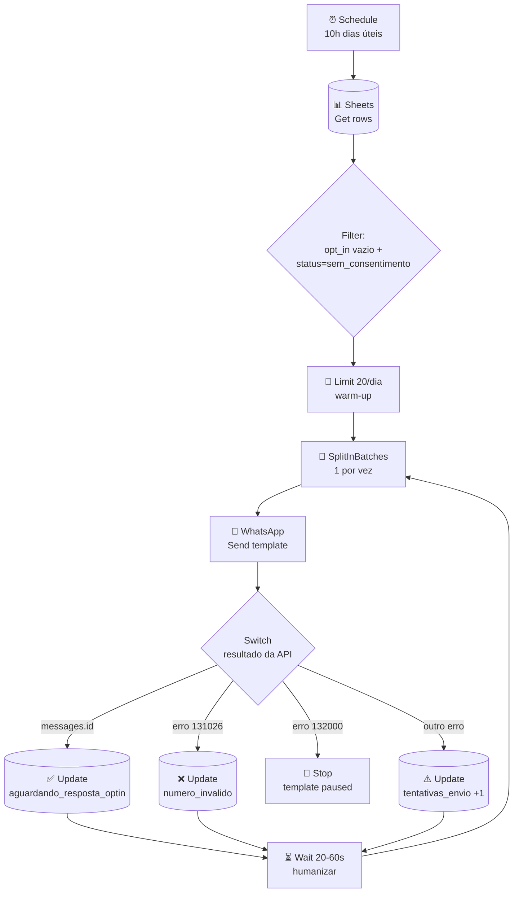
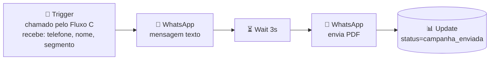
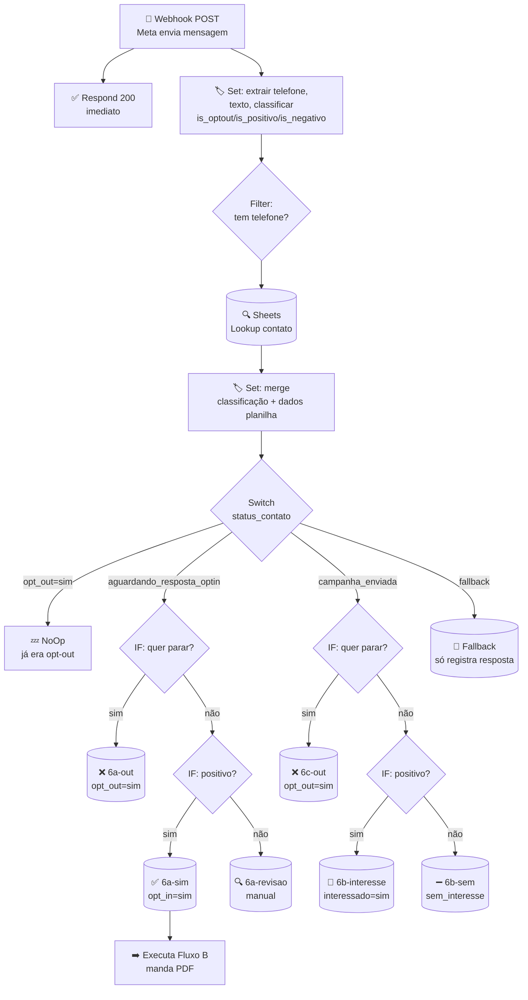
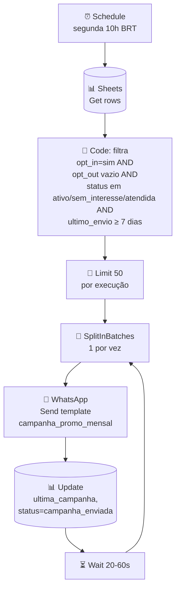
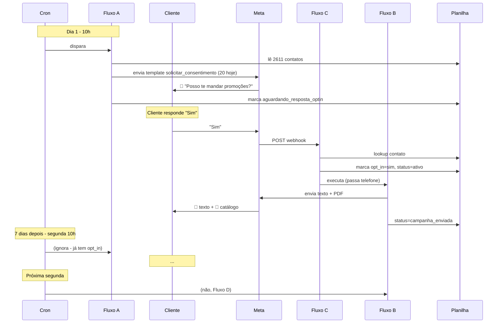

# 📊 Fluxos n8n explicados em diagramas

Documentação visual e didática dos 5 workflows do MVP Luz da Lua.
Cada fluxo tem:
1. **O que ele faz** (em 1 frase)
2. **Diagrama Mermaid** (visual)
3. **O que cada nó faz** (tabela linha-a-linha)

---

## 🎯 Visão geral dos 5 fluxos

| Fluxo | Quando dispara | O que faz |
|---|---|---|
| **Verify GET** | Meta chama 1 vez ao configurar webhook | Confirma que o n8n é seu (handshake) |
| **A - Opt-in** | Cron diário 10h | Manda template `solicitar_consentimento` para quem ainda não respondeu |
| **B - PDF** | Chamado pelo Fluxo C | Envia mensagem de texto + PDF do catálogo |
| **C - Respostas** | Cliente responde no WhatsApp | Classifica resposta e atualiza planilha |
| **D - Campanhas** | Cron semanal segunda 10h | Reengaja quem deu opt-in há ≥7 dias |

---

## 🔐 Fluxo: Webhook Verify GET

**O que faz:** Quando você configura o webhook na Meta, ela faz uma requisição GET com um token. Este fluxo confirma que o token bate com o seu segredo e devolve o `hub.challenge` que a Meta espera.

| Nó | Tipo | O que faz |
|---|---|---|
| **Webhook GET (mesmo path)** | Webhook | Recebe a requisição GET da Meta no path `/whatsapp-respostas` |
| **IF token confere?** | If | Compara `query.hub.verify_token` com a env var `WHATSAPP_VERIFY_TOKEN` |
| **Responder challenge (200)** | Respond | Devolve o valor de `query.hub.challenge` em texto puro com status 200 |
| **Responder 403** | Respond | Devolve `forbidden` com status 403 (token errado = não é a Meta) |

---

## 📤 Fluxo A — Opt-in diário

**O que faz:** Todo dia útil às 10h, lê a planilha, pega quem ainda não tem consentimento, e envia o template `solicitar_consentimento` para até 20 contatos por dia (warm-up).

| Nó | Tipo | O que faz |
|---|---|---|
| **Schedule 10h BRT (dias úteis)** | Cron | Dispara segunda a sexta às 13h UTC = 10h Brasília |
| **Sheets - Get rows** | Sheets | Lê todas as 2611 linhas da planilha |
| **Filter - sem_consentimento** | Filter | Mantém só onde `opt_in` está vazio E `status_contato = sem_consentimento` |
| **Limit (warm-up: 20/dia)** | Limit | Corta para no máximo 20 itens (proteção anti-ban no início) |
| **SplitInBatches** | SplitInBatches | Processa 1 contato por vez (loop) |
| **WhatsApp - Send template** | HTTP Request | POST `graph.facebook.com/v21.0/{phoneId}/messages` com template `solicitar_consentimento` |
| **Switch - resultado API** | Switch | Roteia conforme resposta: sucesso, número inválido, template pausado, ou outro erro |
| **Sheets - Update OK** | Sheets | Marca contato como `aguardando_resposta_optin` |
| **Sheets - numero_invalido** | Sheets | Marca contato como `numero_invalido` (não é WhatsApp) |
| **Stop - template_paused** | StopAndError | Aborta tudo se a Meta pausou o template (precisa intervenção) |
| **Sheets - Falha genérica** | Sheets | Incrementa `tentativas_envio`; se ≥3, marca como `falha_envio` |
| **Wait 20-60s (humanizar)** | Wait | Espera tempo aleatório entre envios (parece humano, não bot) |

---

## 📦 Fluxo B — Pós-consentimento (PDF)

**O que faz:** Sub-workflow chamado pelo Fluxo C quando o cliente aceita receber. Envia uma mensagem de texto explicando + o PDF do catálogo.

| Nó | Tipo | O que faz |
|---|---|---|
| **When Executed by Another Workflow** | Trigger | Recebe `telefone`, `nome`, `segmento` do Fluxo C |
| **WhatsApp - Mensagem texto** | HTTP Request | Envia mensagem livre ("Separei um catálogo com [segmento]...") — só funciona dentro da janela de 24h após cliente responder |
| **Wait 3s** | Wait | Pausa para o texto chegar antes do PDF (UX) |
| **WhatsApp - Envia PDF** | HTTP Request | Envia documento (link do PDF via `CATALOGO_PDF_URL`) |
| **Sheets - Update campanha_enviada** | Sheets | Marca `ultima_campanha=catalogo_pdf_inicial`, `status_contato=campanha_enviada` |

---

## 📥 Fluxo C — Respostas dos clientes (CORAÇÃO DO SISTEMA)

**O que faz:** Toda mensagem que o cliente envia chega aqui. Classifica (opt-out / sim / não) e atualiza a planilha conforme o estado anterior do contato.

| Nó | Tipo | O que faz |
|---|---|---|
| **Webhook POST WhatsApp** | Webhook | Recebe payload da Meta toda vez que cliente envia mensagem |
| **Respond 200 (ack imediato)** | Respond | Devolve 200 NA HORA pra Meta não retentar (ela exige resposta em <5s) |
| **Set - Extrair e classificar** | Set | Pega `telefone`, `texto`, `button_payload` do JSON aninhado da Meta. Classifica via regex: `is_optout` (parar/sair/cancelar), `is_positivo` (sim/quero/aceito), `is_negativo` (não/depois) |
| **Filter - tem telefone** | Filter | Descarta payloads sem telefone (status updates, deliveries) |
| **Sheets - Lookup contato** | Sheets | Busca a linha do telefone na planilha pra saber o estado atual |
| **Set - Merge classificação + planilha** | Set | Junta classificação + dados da planilha (nome, segmento, status, opt_out) |
| **Switch - status_contato** | Switch | Roteia conforme estado: já era opt-out / aguardando opt-in / em campanha / outro |
| **NoOp - já era opt_out** | NoOp | Ignora — cliente já tinha pedido pra sair, não responde nada |
| **IF 5a - opt-in: quer parar?** | If | Cliente em fluxo de opt-in escolheu "não/parar"? |
| **Sheets - 6a-out (opt-out)** | Sheets | Marca `opt_in=nao`, `opt_out=sim`, `status=opt_out` |
| **IF 5b - opt-in: positivo?** | If | Cliente em fluxo de opt-in disse "sim"? |
| **Sheets - 6a-sim (opt-in OK)** | Sheets | Marca `opt_in=sim`, `data_opt_in=agora`, `status=ativo`, salva texto da resposta (LGPD) |
| **Execute Fluxo B (PDF)** | Execute Workflow | Dispara Fluxo B passando telefone/nome/segmento → manda PDF |
| **Sheets - 6a-revisao** | Sheets | Resposta ambígua → marca `revisao_manual` para Anni olhar |
| **IF 5c - campanha: quer parar?** | If | Cliente em campanha pediu pra sair? |
| **Sheets - 6c-out (opt-out)** | Sheets | Mesmo opt-out, mas vindo de campanha |
| **IF 5d - campanha: interesse?** | If | Cliente em campanha demonstrou interesse? |
| **Sheets - 6b-interesse** | Sheets | Marca `interessado=sim`, `status=interessada` (Anni atende manualmente) |
| **Sheets - 6b-sem** | Sheets | Marca `interessado=nao`, `status=sem_interesse` (não recebe esta promo, mas continua na base) |
| **Sheets - Fallback** | Sheets | Outras conversas livres: só registra a resposta sem mudar status |

---

## 🔁 Fluxo D — Campanhas recorrentes

**O que faz:** Toda segunda às 10h, manda uma campanha promocional para quem deu opt-in há ≥7 dias e está em status reativável.

| Nó | Tipo | O que faz |
|---|---|---|
| **Schedule semanal segunda 10h BRT** | Cron | Dispara toda segunda às 13h UTC = 10h Brasília |
| **Sheets - Get rows** | Sheets | Lê todas as linhas da planilha |
| **Code - Filtro elegíveis (7 dias)** | Code (JS) | Filtra: tem opt_in, sem opt_out, status reativável, e último envio há ≥7 dias |
| **Limit por execução** | Limit | Corta para 50 contatos/semana (controle de volume) |
| **SplitInBatches** | SplitInBatches | Processa 1 por vez (loop) |
| **WhatsApp - Send campanha** | HTTP Request | Envia template MARKETING `campanha_promo_mensal` com nome + segmento |
| **Sheets - Update campanha_enviada** | Sheets | Marca `ultima_campanha`, `data_ultimo_envio`, `status=campanha_enviada` |
| **Wait 20-60s** | Wait | Pausa aleatória entre envios (anti-ban) |

---

## 🧠 Como tudo se conecta

---

## 📚 Referências
- Estrutura da planilha: [01-estrutura-planilha.md](01-estrutura-planilha.md)
- Detalhes técnicos dos fluxos: [02-fluxo-n8n.md](02-fluxo-n8n.md)
- Mensagens enviadas: [04-mensagens.md](04-mensagens.md)
- Lógica de status: [05-logica-atualizacao-status.md](05-logica-atualizacao-status.md)
- Setup pós-import: [06-passo-a-passo-implementacao.md](06-passo-a-passo-implementacao.md)
